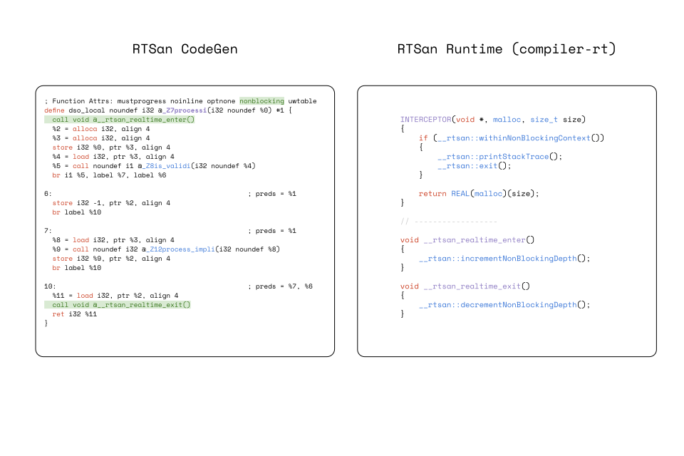

# RealtimeSanitizer (RTSan)

## Document Purpose

This doc is mostly intended for LLVM project code reviewers, but it's also for
anyone interested in how RealtimeSanitizer (RTSan) works and how it will be
integrated upstream. Its aim is to add higher-level context as a supplement to
RTSan's upstream pull requests.

## Background

Algorithms with real-time constraints must guarantee their completion within a
specified time, before their "deadline" expires. Failure to deliver a response
before the deadline is considered a failure of the system, the severity of
which denominates the real-time system's "hardness". A more thorough
description can be readily found
[here](https://en.wikipedia.org/wiki/Real-time_computing).

To guarantee an algorithm's completion in a deterministic time, it must not
call any functions that take a non-deterministic time to complete. Otherwise,
the deadline could be missed and the real-time system may fail. Functions with
non-deterministic execution times are commonly found in C and C++ programs:
dynamic memory (de)allocation and (un)locking mutexes are ubiquitous examples,
because they are not commonly implemented with
[_non-blocking_](https://en.wikipedia.org/wiki/Non-blocking_algorithm#:~:text=A%20non%2Dblocking%20algorithm%20is,of%20obstruction%2Dfreedom%20in%202003.)
algorithms. An important part of the real-time programming challenge is
therefore to:

1. satisfy the logical requirements of the system, while
2. avoiding calling any functions that could block.

In practice, implementing an algorithm without blocking function calls in C++
is often a non-trivial task. Dynamic memory allocations, for example, can be
hidden at a level below the API of the C++ STL (consider the construction of a
capturing `std::function`). Mutex locks can appear in surprising places
(consider `std::atomic<std::array<int, 4>>::load()`). Small changes in one part
of a codebase can introduce devastating effects on the real-time safety of a
system, and it may not be obvious why. Even just reaching a thorough
understanding of what STL features are safe for use in a non-blocking context
can require significant developer experience.

RealtimeSanitizer (RTSan) provides a means of automatically detecting calls to
blocking functions in algorithms that should be non-blocking. If a user:

1. Marks their real-time functions with the `[[clang::nonblocking]]` attribute:

```cpp
void process (processing_data const & data) [[clang::nonblocking]]
{
    auto x = std::vector<float> (16); // oops!
}
```

2. Adds `-fsanitize=realtime` to their compile and link flags

```sh
clang -fsanitize=realtime main.cpp
```

Blocking function calls, like the memory allocation above, are considered
_real-time violations_, and result in a RTSan error like:

```cpp
Real-time violation: intercepted call to real-time unsafe function `malloc` in non-blocking context! Stack trace:
    #0 0x5644f383d78a in rtsan::printStackTrace() /llvm-project/compiler-rt/lib/rtsan/rtsan_stack.cpp:36:5
    #1 0x5644f383d630 in rtsan::Context::printDiagnostics(char const*) /llvm-project/compiler-rt/lib/rtsan/rtsan_context.cpp:37:3
    #2 0x5644f383d5d5 in rtsan::Context::exitIfNonblocking(char const*) /llvm-project/compiler-rt/lib/rtsan/rtsan_context.cpp:24:5
    #3 0x5644f383e067 in exitIfNonblocking /llvm-project/compiler-rt/lib/rtsan/rtsan_interceptors.cpp:29:29
    #4 0x5644f383e067 in malloc /llvm-project/compiler-rt/lib/rtsan/rtsan_interceptors.cpp:221:3
    #5 0x7f7a072b798b in operator new(unsigned long) (/lib/x86_64-linux-gnu/libstdc++.so.6+0xae98b) (BuildId: e37fe1a879783838de78cbc8c80621fa685d58a2)
    #6 0x5644f3861d7f in std::__new_allocator<float>::allocate(unsigned long, void const*) (/root/test/a.out+0x2ad7f)
    #7 0x5644f3861d10 in std::allocator_traits<std::allocator<float>>::allocate(std::allocator<float>&, unsigned long) (/root/test/a.out+0x2ad10)
    #8 0x5644f3861ccf in std::_Vector_base<float, std::allocator<float>>::_M_allocate(unsigned long) (/root/test/a.out+0x2accf)
    #9 0x5644f3861c20 in std::_Vector_base<float, std::allocator<float>>::_M_create_storage(unsigned long) (/root/test/a.out+0x2ac20)
    #10 0x5644f38619b1 in std::_Vector_base<float, std::allocator<float>>::_Vector_base(unsigned long, std::allocator<float> const&) (/root/test/a.out+0x2a9b1)
    #11 0x5644f3861838 in std::vector<float, std::allocator<float>>::vector(unsigned long, std::allocator<float> const&) (/root/test/a.out+0x2a838)
    #12 0x5644f3861767 in process(processing_data const&) (/root/test/a.out+0x2a767)
    #13 0x5644f38617d0 in main (/root/test/a.out+0x2a7d0)
    #14 0x7f7a06eefd8f  (/lib/x86_64-linux-gnu/libc.so.6+0x29d8f) (BuildId: a43bfc8428df6623cd498c9c0caeb91aec9be4f9)
    #15 0x7f7a06eefe3f in __libc_start_main (/lib/x86_64-linux-gnu/libc.so.6+0x29e3f) (BuildId: a43bfc8428df6623cd498c9c0caeb91aec9be4f9)
    #16 0x5644f383d4a4 in _start (/root/test/a.out+0x64a4)
```

## How it works

Like the existing sanitizers, RTSan instruments the user's binary with
interceptors for blocking functions in libc like `malloc`, `free` and
`pthread_mutex_lock`. Non-blocking contexts are defined by the user simply by
marking functions with the `[[clang::nonblocking]]` attribute, at a granularity
of their choosing.

The RTSan algorithm is straightforwardly implemented in clang's `CodeGen`, and
a new `rtsan` sanitizer runtime library in `compiler-rt`. RTSan's additions
to `CodeGen` signal entry and exit from non-blocking contexts by calling
`rtsan_realtime_enter()` at `[[clang::nonblocking]]` function entry points and
`rtsan_realtime_exit()` at all exit points. The runtime library keeps track of
these calls and intercepts system library functions that are known to be
blocking. If a blocking function call is made within a non-blocking context,
the runtime library exits with an error message and stack trace.



## Integration Roadmap

We're planning to submit PRs for the following units of functionality:

- [x] RTSan backend and unit tests (compiler-rt only). Completed in this review: https://github.com/llvm/llvm-project/pull/92460
- [ ] RTSan CodeGen (clang) attributes (llvm) and functional (lit) tests (compiler-rt)

We believe that the above will be enough to have a minimum viable featureset.
We'd like to submit further PRs for the following feature improvements:

- [ ] Bypass sanitization with `__attribute__(nosanitize("realtime"))`
- [ ] Addition of a RTSan ignore list for silencing errors
- [ ] Error if call to `[[clang::blocking]]` function is called from `[[clang::nonblocking]]` function
- [ ] Configurable behaviour on errors: exit, continue, or ask the user
